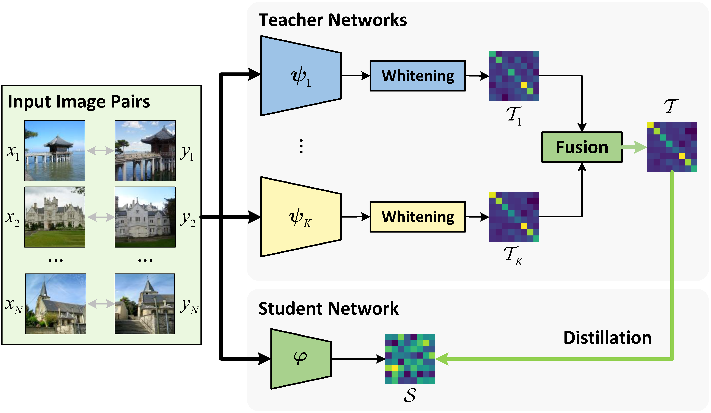

# Whiten_MTD
Official repository of paper "Let All be Whitened: Multi-teacher Distillation for Efficient Visual Retrieval" accepted by AAAI 2024.


## Prepare environment
Create a conda virtual environment and install required packages:
```shell
conda create -n whiten_mtd python=3.8
conda activate whiten_mtd
pip install -r requirements.txt
```

## Prepare dataset
We use [Google Landmark V2 (GLDv2)](https://github.com/cvdfoundation/google-landmark) and [SVD](https://svdbase.github.io/) as training datasets which can be downloaded following their official repositories. GLDv2 can be used for training by passing its root path to the argument of script ```gld_pca_learn.py``` and ```gld_distill.py```. To train on SVD, configuration file ```svd.yaml``` in ```config``` directory should be correspondingly modified.

Other two datasets [Roxford5k and RParis6k](http://cmp.felk.cvut.cz/revisitop/) should also be downloaded for evaluation.

## Evaluation
Pretrained weights of teacher models and their PCA-Whitening layer can be downloaded from [here](https://drive.google.com/drive/folders/1-9BOzGBCNY6FrGCmpefSfispWHfiVMOd?usp=sharing).
### Instance image retrieval
Pretrained student model checkpoints can be downloaded from the links below:

| Teachers | Student | Links |
| :-: | :-: | :-: |
| GeM, AP-GeM, SOLAR | R18 | [rg_rag_rs_to_r18_ep200](https://drive.google.com/file/d/1qLp_AoI5SRNs9AV3o8SzJchyXwBFSsDL/view?usp=sharing) |
| GeM, AP-GeM, SOLAR | R34 | [rg_rag_rs_to_r34_ep200](https://drive.google.com/file/d/1wsPIgGnXw6TPmVDtyFLYXSFF1YzRePCE/view?usp=sharing) |
| DOLG, DELG | R18 | [ro_re_to_r18_ep3k](https://drive.google.com/file/d/1TDi9WelEu7Ks5fAOIMQftSroZzDXzKaM/view?usp=sharing) |
| DOLG, DELG | R34 | [ro_re_to_r34_ep3k](https://drive.google.com/file/d/1XVnURGdqdmJ1GiMswNEgHLji_NCpdBCV/view?usp=sharing) |

To perform evaluation using our pretrained weights:
```shell
python oxford_paris_eval.py -a resnet18/34 -r PATH_TO_CHECKPOINT -dp PATH_TO_DATASET --embed_dim 512 -ms -p 3
```

### Video retrieval
Pretrained student model checkpoints can be downloaded from the links below:

| Teachers | Student | Links |
| :-: | :-: | :-: |
| MoCoV3, BarlowTwins | R18 | [mc_bt_to_r18_ep3k](https://drive.google.com/file/d/1yKv2-TGHwaAlQOugLpiOjo64TpHaM176/view?usp=sharing) |
| MoCoV3, BarlowTwins | R34 | [mc_bt_to_r34_ep3k](https://drive.google.com/file/d/1GrkzoeT8QUAqY6B7Jio6TqkDa0rsb7PN/view?usp=sharing) |

To perform evaluation using our pretrained weights:
```shell
python svd_eval.py -a resnet18/34 -dm config/svd.yaml --sim_fn cf -r PATH_TO_CHECKPOINT --embed_dim 512
```

## Training
We train all the models on a server with 8 16G V100 and batch size of 256. Run the following with our default settings to train your own models:

- On GLDv2:
```shell
python gld_distill.py -a resnet18/34 -ts resnet101_delg resnet101_dolg -c PATH_TO_SAVE_CHECKPOINTS --gld_root_path PATH_TO_DATASET
```
- On SVD:
```shell
python svd_distill.py -a resnet18/34 -ts mocov3 barlowtwins -c PATH_TO_SAVE_CHECKPOINTS -dm config/svd.yaml 
```
